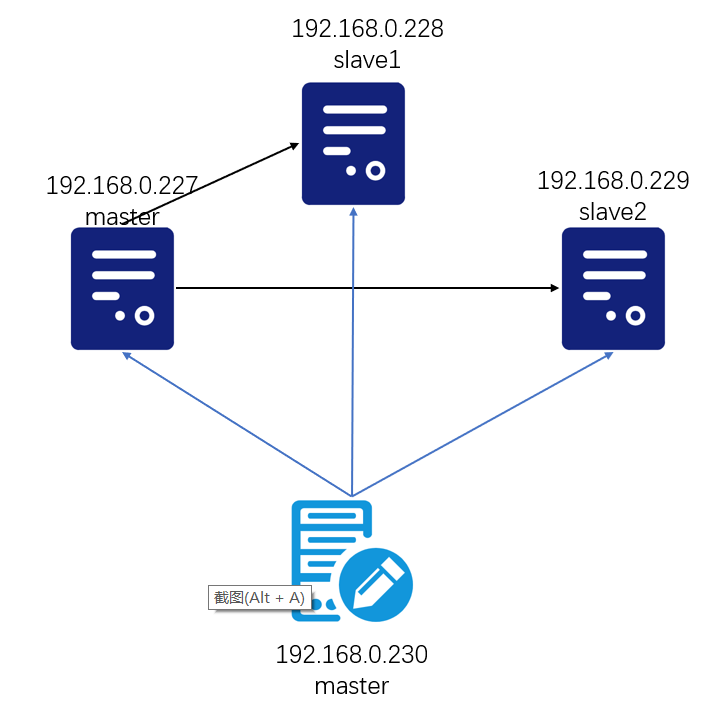

### 一、环境以及软件版本

| 环境                      | 版本   |
| ------------------------- | ------ |
| 操作系统：Centos 7 x86_64 | 7      |
| 虚拟机：WMware            | 15.5   |
| 远程连接：XShell          | 6.0    |
| 数据库：msql              | 5.7.28 |
| 文件传输：XFtp            | 6.0    |

### 二、整体架构

MHA环境由**MHA Manager（管理节点）和MHA Node（数据节点）**。MHA Manager可以单独部署在一台独立的机器上管理多个master-slave集群，这里管理一个数据集群。MHA Node运行在每台MySQL服务器上，MHA Manager会定时探测集群中的master节点，当master出现故障时，它可以自动将最新数据的slave提升为新的master，然后将所有其他的slave重新指向新的master。整个故障转移过程对应用程序完全透明。

| 主机IP        | 角色    | server-id |      |
| ------------- | ------- | --------- | ---- |
| 192.168.0.227 | master  | 1         | 主库 |
| 192.168.0.228 | slave1  | 2         | 从库 |
| 192.168.0.229 | slave2  | 3         | 从库 |
| 192.168.0.230 | manager |           | 监控 |



### 三、MySQL主从搭建

#### 3.1、环境准备

##### 3.1.1、下载

从官网下载mysql5.7.28：

```shell
[root@localhost mysql-rpm]# wget https://cdn.mysql.com/archives/mysql-5.7/mysql-5.7.28-1.el7.x86_64.rpm-bundle.tar
```

当然也可以从国内镜像下载各个安装文件。

下载地址：https://mirrors.tuna.tsinghua.edu.cn/mysql/yum/mysql-5.7-community-el7-x86_64/

解压：

```shell
[root@localhost mysql-rpm]# tar -xvf mysql-5.7.28-1.el7.x86_64.rpm-bundle.tar 
mysql-community-embedded-5.7.28-1.el7.x86_64.rpm
mysql-community-libs-compat-5.7.28-1.el7.x86_64.rpm
mysql-community-devel-5.7.28-1.el7.x86_64.rpm
mysql-community-embedded-compat-5.7.28-1.el7.x86_64.rpm
mysql-community-libs-5.7.28-1.el7.x86_64.rpm
mysql-community-test-5.7.28-1.el7.x86_64.rpm
mysql-community-common-5.7.28-1.el7.x86_64.rpm
mysql-community-embedded-devel-5.7.28-1.el7.x86_64.rpm
mysql-community-client-5.7.28-1.el7.x86_64.rpm
mysql-community-server-5.7.28-1.el7.x86_64.rpm

```

##### 3.1.2、安装

安装mysql包括common、libs、libs-compat、client、server包。在安装之前首先确保centos自带的mariadb。

```shell
[root@localhost mysql-rpm]# rpm -qa | grep mariadb
mariadb-libs-5.5.41-2.el7_0.x86_64
[root@localhost mysql-rpm]# rpm -e --nodeps mariadb-libs-5.5.41-2.el7_0.x86_64
```

关闭防火墙

```shell
[root@localhost mysql-rpm]# systemctl stop firewalld
[root@localhost mysql-rpm]# systemctl disable firewalld.service
rm '/etc/systemd/system/dbus-org.fedoraproject.FirewallD1.service'
rm '/etc/systemd/system/basic.target.wants/firewalld.service'
```

安装mysql：

```shell
[root@localhost mysql-rpm]# rpm -ivh mysql-community-common-5.7.28-1.el7.x86_64.rpm 
warning: mysql-community-common-5.7.28-1.el7.x86_64.rpm: Header V3 DSA/SHA1 Signature, key ID 5072e1f5: NOKEY
Preparing...                          ################################# [100%]
Updating / installing...
   1:mysql-community-common-5.7.28-1.e################################# [100%]
[root@localhost mysql-rpm]# rpm -ivh mysql-community-libs-5.7.28-1.el7.x86_64.rpm 
warning: mysql-community-libs-5.7.28-1.el7.x86_64.rpm: Header V3 DSA/SHA1 Signature, key ID 5072e1f5: NOKEY
Preparing...                          ################################# [100%]
Updating / installing...
   1:mysql-community-libs-5.7.28-1.el7################################# [100%]
[root@localhost mysql-rpm]# rpm -ivh mysql-community-libs-compat-5.7.28-1.el7.x86_64.rpm 
warning: mysql-community-libs-compat-5.7.28-1.el7.x86_64.rpm: Header V3 DSA/SHA1 Signature, key ID 5072e1f5: NOKEY
Preparing...                          ################################# [100%]
Updating / installing...
   1:mysql-community-libs-compat-5.7.2################################# [100%]
[root@localhost mysql-rpm]# rpm -ivh mysql-community-client-5.7.28-1.el7.x86_64.rpm 
warning: mysql-community-client-5.7.28-1.el7.x86_64.rpm: Header V3 DSA/SHA1 Signature, key ID 5072e1f5: NOKEY
Preparing...                          ################################# [100%]
Updating / installing...
   1:mysql-community-client-5.7.28-1.e################################# [100%]
[root@localhost mysql-rpm]# rpm -ivh mysql-community-server-5.7.28-1.el7.x86_64.rpm 
warning: mysql-community-server-5.7.28-1.el7.x86_64.rpm: Header V3 DSA/SHA1 Signature, key ID 5072e1f5: NOKEY
Preparing...                          ################################# [100%]
Updating / installing...
   1:mysql-community-server-5.7.28-1.e################################# [100%]
[root@localhost mysql-rpm]# rpm -ivh mysql-community-devel-5.7.28-1.el7.x86_64.rpm 
warning: mysql-community-devel-5.7.28-1.el7.x86_64.rpm: Header V3 DSA/SHA1 Signature, key ID 5072e1f5: NOKEY
Preparing...                          ################################# [100%]
Updating / installing...
   1:mysql-community-devel-5.7.28-1.el################################# [100%]

```

##### 3.1.3、启动

初始化数据库

```shell
[root@localhost mysql-rpm]# mysqld --initialize --user=mysql
```

将mysql做成系统服务

```shell
[root@localhost mysql-rpm]# systemctl start mysqld.service
[root@localhost mysql-rpm]# systemctl status mysqld.service
mysqld.service - MySQL Server
   Loaded: loaded (/usr/lib/systemd/system/mysqld.service; enabled)
   Active: active (running) since Fri 2020-08-28 22:31:57 CST; 22s ago
     Docs: man:mysqld(8)
           http://dev.mysql.com/doc/refman/en/using-systemd.html
  Process: 48312 ExecStart=/usr/sbin/mysqld --daemonize --pid-file=/var/run/mysqld/mysqld.pid $MYSQLD_OPTS (code=exited, status=0/SUCCESS)
  Process: 48291 ExecStartPre=/usr/bin/mysqld_pre_systemd (code=exited, status=0/SUCCESS)
 Main PID: 48316 (mysqld)
   CGroup: /system.slice/mysqld.service
           └─48316 /usr/sbin/mysqld --daemonize --pid-file=/var/run/mysqld/mysqld.pi...
```

修改mysql的初始化密码为root。

```shell
[root@localhost mysql-rpm]# cat /var/log/mysqld.log 
....
2020-08-28T14:25:52.749574Z 1 [Note] A temporary password is generated for root@localhost: kwd!.Ob0l&mf
....
[root@localhost mysql-rpm]# mysql -uroot -p
Enter password: 
Welcome to the MySQL monitor.  Commands end with ; or \g.
Your MySQL connection id is 2
Server version: 5.7.28

Copyright (c) 2000, 2019, Oracle and/or its affiliates. All rights reserved.

Oracle is a registered trademark of Oracle Corporation and/or its
affiliates. Other names may be trademarks of their respective
owners.

Type 'help;' or '\h' for help. Type '\c' to clear the current input statement.

mysql> set password=password('root');
Query OK, 0 rows affected, 1 warning (0.03 sec)

```

三台mysql的机器都需要按照以上步骤安装mysql软件。

#### 3.2、MySQL主从配置

##### 3.2.1、Master节点配置

主库配置主要包含开启binlong日志，设置server-id。

修改/etc/my.cnf。

```cnf
[mysqld]
#开启binlog日志功能
log_bin=mysql-bin
#设置server-id
server-id=1

sync-binlog=1
#设置忽略的数据库
binlog-ignore-db=information_schema
binlog-ignore-db=performance_schema
binlog-ignore-db=sys
binlog-ignore-db=mysql

#设置semi开启和超时设置，这里暂时不开启，安装完半同步的sime插件后开启。
rpl_semi_sync_master_enabled=ON
rpl_semi_sync_master_timeout=1000
```

保存之后重启数据库：

```shell
[root@localhost mysql-rpm]# systemctl restart mysqld
```

登录master，并且给从库进行授权操作，授权之后刷新权限。

```mysql
-- 授权
mysql> grant replication slave on *.* to 'root'@'%' identified by 'root';
Query OK, 0 rows affected, 1 warning (0.00 sec)

mysql> grant all privileges on *.* to 'root'@'%' identified by 'root';
Query OK, 0 rows affected, 1 warning (0.00 sec)

-- 刷新权限
mysql> flush privileges;
Query OK, 0 rows affected (0.00 sec)
```

查看主库Master的状态。

```mysql
mysql> show master status \G;
*************************** 1. row ***************************
             File: mysql-bin.000001
         Position: 869
     Binlog_Do_DB: 
 Binlog_Ignore_DB: information_schema,performance_schema,sys
Executed_Gtid_Set: 
1 row in set (0.00 sec)
```

##### 3.2.2、Slave节点配置

从库开启relay-log中继日志，并且制定server-id。

编辑/etc/my.cnf配置文件。

```cnf
log_bin=mysql-bin
sync-binlog=1
binlog-ignore-db=information_schema
binlog-ignore-db=mysql
binlog-ignore-db=performance_schema
binlog-ignore-db=sys

#指定server id,slave2机器配置为3
server-id=2
#指定中继日志名称
relay_log=mysql-relay-bin
#开启数据库只读
read_only=1
```

重启mysql的slave服务器。

```shell
[root@localhost mysql-rpm]# systemctl restart mysqld
```

登录两台slave服务器，创建连接到master服务器进行同步。

```mysql
mysql> change master to master_host='192.168.0.227',master_port=3306,master_user='root',master_password='root',master_log_file='mysql-bin.000001',master_log_pos=869;
Query OK, 0 rows affected, 2 warnings (0.01 sec)
```

启动slave

```mysql
mysql> start slave;
Query OK, 0 rows affected (0.00 sec)
```

查看slave状态，主要观察IO线程是否启动。

```mysql
mysql> show slave status \G;
*************************** 1. row ***************************
               Slave_IO_State: Waiting for master to send event
                  Master_Host: 192.168.0.227
                  Master_User: root
                  Master_Port: 3306
                Connect_Retry: 60
              Master_Log_File: mysql-bin.000001
          Read_Master_Log_Pos: 869
               Relay_Log_File: mysql-relay-bin.000002
                Relay_Log_Pos: 320
        Relay_Master_Log_File: mysql-bin.000001
             Slave_IO_Running: Yes
            Slave_SQL_Running: Yes
              Replicate_Do_DB: 
          Replicate_Ignore_DB: 
           Replicate_Do_Table: 
       Replicate_Ignore_Table: 
      Replicate_Wild_Do_Table: 
  Replicate_Wild_Ignore_Table: 
                   Last_Errno: 0
                   Last_Error: 
                 Skip_Counter: 0
          Exec_Master_Log_Pos: 869
              Relay_Log_Space: 527
              Until_Condition: None
               Until_Log_File: 
                Until_Log_Pos: 0
           Master_SSL_Allowed: No
           Master_SSL_CA_File: 
           Master_SSL_CA_Path: 
              Master_SSL_Cert: 
            Master_SSL_Cipher: 
               Master_SSL_Key: 
        Seconds_Behind_Master: 0
Master_SSL_Verify_Server_Cert: No
                Last_IO_Errno: 0
                Last_IO_Error: 
               Last_SQL_Errno: 0
               Last_SQL_Error: 
  Replicate_Ignore_Server_Ids: 
             Master_Server_Id: 1
                  Master_UUID: 602ea3e4-e93a-11ea-8dec-000c29ede32b
             Master_Info_File: /var/lib/mysql/master.info
                    SQL_Delay: 0
          SQL_Remaining_Delay: NULL
      Slave_SQL_Running_State: Slave has read all relay log; waiting for more updates
           Master_Retry_Count: 86400
                  Master_Bind: 
      Last_IO_Error_Timestamp: 
     Last_SQL_Error_Timestamp: 
               Master_SSL_Crl: 
           Master_SSL_Crlpath: 
           Retrieved_Gtid_Set: 
            Executed_Gtid_Set: 
                Auto_Position: 0
         Replicate_Rewrite_DB: 
                 Channel_Name: 
           Master_TLS_Version: 
1 row in set (0.00 sec)
```

对从库进行链接授权：

```mysql
mysql> grant all privileges on *.* to 'root'@'%' identified by 'root';
Query OK, 0 rows affected, 1 warning (0.00 sec)

mysql> flush privileges;
Query OK, 0 rows affected (0.01 sec)
```


#### 3.3、半同步配置

在从库收到binlog日志之后给master发送ack消息，主库收到ACK消息之后，主库进行commit。

半同步复制需要安装sime插件。

首先检查主库是否支持动态插件的安装：

```mysql
mysql> select @@have_dynamic_loading;
+------------------------+
| @@have_dynamic_loading |
+------------------------+
| YES                    |
+------------------------+
1 row in set (0.00 sec)
```

##### 3.3.1、Master节点配置

检查数据库是否已经安装了sime插件。

```mysql
mysql> show plugins;
+----------------------------+----------+--------------------+---------+---------+
| Name                       | Status   | Type               | Library | License |
+----------------------------+----------+--------------------+---------+---------+
| binlog                     | ACTIVE   | STORAGE ENGINE     | NULL    | GPL     |
| mysql_native_password      | ACTIVE   | AUTHENTICATION     | NULL    | GPL     |
| sha256_password            | ACTIVE   | AUTHENTICATION     | NULL    | GPL     |
| CSV                        | ACTIVE   | STORAGE ENGINE     | NULL    | GPL     |
| MEMORY                     | ACTIVE   | STORAGE ENGINE     | NULL    | GPL     |
| InnoDB                     | ACTIVE   | STORAGE ENGINE     | NULL    | GPL     |
| INNODB_TRX                 | ACTIVE   | INFORMATION SCHEMA | NULL    | GPL     |
| INNODB_LOCKS               | ACTIVE   | INFORMATION SCHEMA | NULL    | GPL     |
| INNODB_LOCK_WAITS          | ACTIVE   | INFORMATION SCHEMA | NULL    | GPL     |
| INNODB_CMP                 | ACTIVE   | INFORMATION SCHEMA | NULL    | GPL     |
| INNODB_CMP_RESET           | ACTIVE   | INFORMATION SCHEMA | NULL    | GPL     |
| INNODB_CMPMEM              | ACTIVE   | INFORMATION SCHEMA | NULL    | GPL     |
| INNODB_CMPMEM_RESET        | ACTIVE   | INFORMATION SCHEMA | NULL    | GPL     |
| INNODB_CMP_PER_INDEX       | ACTIVE   | INFORMATION SCHEMA | NULL    | GPL     |
| INNODB_CMP_PER_INDEX_RESET | ACTIVE   | INFORMATION SCHEMA | NULL    | GPL     |
| INNODB_BUFFER_PAGE         | ACTIVE   | INFORMATION SCHEMA | NULL    | GPL     |
| INNODB_BUFFER_PAGE_LRU     | ACTIVE   | INFORMATION SCHEMA | NULL    | GPL     |
| INNODB_BUFFER_POOL_STATS   | ACTIVE   | INFORMATION SCHEMA | NULL    | GPL     |
| INNODB_TEMP_TABLE_INFO     | ACTIVE   | INFORMATION SCHEMA | NULL    | GPL     |
| INNODB_METRICS             | ACTIVE   | INFORMATION SCHEMA | NULL    | GPL     |
| INNODB_FT_DEFAULT_STOPWORD | ACTIVE   | INFORMATION SCHEMA | NULL    | GPL     |
| INNODB_FT_DELETED          | ACTIVE   | INFORMATION SCHEMA | NULL    | GPL     |
| INNODB_FT_BEING_DELETED    | ACTIVE   | INFORMATION SCHEMA | NULL    | GPL     |
| INNODB_FT_CONFIG           | ACTIVE   | INFORMATION SCHEMA | NULL    | GPL     |
| INNODB_FT_INDEX_CACHE      | ACTIVE   | INFORMATION SCHEMA | NULL    | GPL     |
| INNODB_FT_INDEX_TABLE      | ACTIVE   | INFORMATION SCHEMA | NULL    | GPL     |
| INNODB_SYS_TABLES          | ACTIVE   | INFORMATION SCHEMA | NULL    | GPL     |
| INNODB_SYS_TABLESTATS      | ACTIVE   | INFORMATION SCHEMA | NULL    | GPL     |
| INNODB_SYS_INDEXES         | ACTIVE   | INFORMATION SCHEMA | NULL    | GPL     |
| INNODB_SYS_COLUMNS         | ACTIVE   | INFORMATION SCHEMA | NULL    | GPL     |
| INNODB_SYS_FIELDS          | ACTIVE   | INFORMATION SCHEMA | NULL    | GPL     |
| INNODB_SYS_FOREIGN         | ACTIVE   | INFORMATION SCHEMA | NULL    | GPL     |
| INNODB_SYS_FOREIGN_COLS    | ACTIVE   | INFORMATION SCHEMA | NULL    | GPL     |
| INNODB_SYS_TABLESPACES     | ACTIVE   | INFORMATION SCHEMA | NULL    | GPL     |
| INNODB_SYS_DATAFILES       | ACTIVE   | INFORMATION SCHEMA | NULL    | GPL     |
| INNODB_SYS_VIRTUAL         | ACTIVE   | INFORMATION SCHEMA | NULL    | GPL     |
| MyISAM                     | ACTIVE   | STORAGE ENGINE     | NULL    | GPL     |
| MRG_MYISAM                 | ACTIVE   | STORAGE ENGINE     | NULL    | GPL     |
| PERFORMANCE_SCHEMA         | ACTIVE   | STORAGE ENGINE     | NULL    | GPL     |
| ARCHIVE                    | ACTIVE   | STORAGE ENGINE     | NULL    | GPL     |
| BLACKHOLE                  | ACTIVE   | STORAGE ENGINE     | NULL    | GPL     |
| FEDERATED                  | DISABLED | STORAGE ENGINE     | NULL    | GPL     |
| partition                  | ACTIVE   | STORAGE ENGINE     | NULL    | GPL     |
| ngram                      | ACTIVE   | FTPARSER           | NULL    | GPL     |
+----------------------------+----------+--------------------+---------+---------+
44 rows in set (0.00 sec)
```

安装sime插件，并且参考morialdb给插件取个名字semisync_master.so：

```mysql
mysql> install plugin rpl_semi_sync_master soname 'semisync_master.so';
Query OK, 0 rows affected (0.01 sec)
```

安装完成之后可以查看semi的环境变量信息。

```sql
mysql> show variables like '%semi%';
+-------------------------------------------+------------+
| Variable_name                             | Value      |
+-------------------------------------------+------------+
| rpl_semi_sync_master_enabled              | OFF        |
| rpl_semi_sync_master_timeout              | 10000      |
| rpl_semi_sync_master_trace_level          | 32         |
| rpl_semi_sync_master_wait_for_slave_count | 1          |
| rpl_semi_sync_master_wait_no_slave        | ON         |
| rpl_semi_sync_master_wait_point           | AFTER_SYNC |
+-------------------------------------------+------------+
6 rows in set (0.00 sec)
```

之后开启semi的功能，开启semi有两种方法，一种是set global ...，另一种是配置my.cnf。需要设置超时时间，默认10秒钟过长，改成1秒钟。

```sql
mysql> set global rpl_semi_sync_master_enabled=1;
Query OK, 0 rows affected (0.00 sec)

mysql> set global rpl_semi_sync_master_timeout=1000;
Query OK, 0 rows affected (0.01 sec)

mysql> show variables like '%semi%';
+-------------------------------------------+------------+
| Variable_name                             | Value      |
+-------------------------------------------+------------+
| rpl_semi_sync_master_enabled              | ON         |
| rpl_semi_sync_master_timeout              | 1000       |
| rpl_semi_sync_master_trace_level          | 32         |
| rpl_semi_sync_master_wait_for_slave_count | 1          |
| rpl_semi_sync_master_wait_no_slave        | ON         |
| rpl_semi_sync_master_wait_point           | AFTER_SYNC |
+-------------------------------------------+------------+
6 rows in set (0.00 sec)
```

##### 3.3.2、Slave节点配置

从库也需要做semi的安装操作，安装semi_slave插件。

```mysql
mysql> install plugin rpl_semi_sync_slave soname 'semisync_slave.so';
Query OK, 0 rows affected (0.03 sec)
```

查看semi的环境变量。

```mysql
mysql> show variables like '%semi%';
+---------------------------------+-------+
| Variable_name                   | Value |
+---------------------------------+-------+
| rpl_semi_sync_slave_enabled     | OFF   |
| rpl_semi_sync_slave_trace_level | 32    |
+---------------------------------+-------+
2 rows in set (0.01 sec)
```

开启semi功能

```mysql
mysql> set global rpl_semi_sync_slave_enabled=1;
Query OK, 0 rows affected (0.00 sec)
```

重启slave

```mysql
mysql> stop slave;
Query OK, 0 rows affected (0.01 sec)

mysql> start slave;
Query OK, 0 rows affected (0.00 sec)
```

##### 3.3.3、测试

检查mysql日志，查看semi模块是否已经启用。

```shell
[root@localhost mysql-rpm]# tail -f /var/log/mysqld.log 
2020-08-29T08:51:59.548417Z 0 [Note] Failed to start slave threads for channel ''
2020-08-29T08:51:59.678700Z 0 [Note] Event Scheduler: Loaded 0 events
2020-08-29T08:51:59.679144Z 0 [Note] /usr/sbin/mysqld: ready for connections.
Version: '5.7.28'  socket: '/var/lib/mysql/mysql.sock'  port: 3306  MySQL Community Server (GPL)
2020-08-29T15:19:05.795648Z 2 [Note] 'CHANGE MASTER TO FOR CHANNEL '' executed'. Previous state master_host='', master_port= 3306, master_log_file='', master_log_pos= 4, master_bind=''. New state master_host='192.168.0.227', master_port= 3306, master_log_file='mysql-bin.000001', master_log_pos= 869, master_bind=''.
2020-08-29T15:19:41.635138Z 3 [Note] Slave I/O thread: Start semi-sync replication to master 'root@192.168.0.227:3306' in log 'mysql-bin.000001' at position 869
2020-08-29T15:19:41.635214Z 3 [Warning] Storing MySQL user name or password information in the master info repository is not secure and is therefore not recommended. Please consider using the USER and PASSWORD connection options for START SLAVE; see the 'START SLAVE Syntax' in the MySQL Manual for more information.
2020-08-29T15:19:41.638339Z 4 [Warning] Slave SQL for channel '': If a crash happens this configuration does not guarantee that the relay log info will be consistent, Error_code: 0
2020-08-29T15:19:41.638405Z 4 [Note] Slave SQL thread for channel '' initialized, starting replication in log 'mysql-bin.000001' at position 869, relay log './mysql-relay-bin.000001' position: 4
2020-08-29T15:19:41.659430Z 3 [Note] Slave I/O thread for channel '': connected to master 'root@192.168.0.227:3306',replication started in log 'mysql-bin.000001' at position 869
```


### 四、MHA高可用搭建

#### 4.1、环境准备

##### 4.1.1、主机SSH互通

在四台服务器上分别执行下面命令，生成公钥和私钥。

```shell
[root@localhost ~]# ssh-keygen -t rsa
Generating public/private rsa key pair.
Enter file in which to save the key (/root/.ssh/id_rsa): 
Created directory '/root/.ssh'.
Enter passphrase (empty for no passphrase): 
Enter same passphrase again: 
Your identification has been saved in /root/.ssh/id_rsa.
Your public key has been saved in /root/.ssh/id_rsa.pub.
The key fingerprint is:
68:86:33:a6:0a:fc:df:e0:36:d4:d1:a0:18:1d:f3:75 root@localhost.localdomain
The key's randomart image is:
+--[ RSA 2048]----+
|    .o.  . E     |
|   . .o.. .      |
|    o ..o        |
|   . o o .       |
|    = = S        |
|.  o * .         |
|... ..           |
|... .oo          |
|.  .oo..         |
+-----------------+

```

在三台MySQL服务器分别执行下面命令，将公钥拷贝到MHA Manager服务器上。

```shell
[root@localhost mysql-rpm]# ssh-copy-id 192.168.0.230
The authenticity of host '192.168.0.230 (192.168.0.230)' can't be established.
ECDSA key fingerprint is a0:a7:22:1d:23:06:a1:86:d9:6e:4a:fe:e4:45:d4:72.
Are you sure you want to continue connecting (yes/no)? yes
/usr/bin/ssh-copy-id: INFO: attempting to log in with the new key(s), to filter out any that are already installed
/usr/bin/ssh-copy-id: INFO: 1 key(s) remain to be installed -- if you are prompted now it is to install the new keys
root@192.168.0.230's password: 

Number of key(s) added: 1

Now try logging into the machine, with:   "ssh '192.168.0.230'"
and check to make sure that only the key(s) you wanted were added.

```

在MHA Manager服务器检查是否成功上传公钥。

```shell
[root@localhost ~]# cat /root/.ssh/authorized_keys 
ssh-rsa AAAAB3NzaC1yc2EAAAADAQABAAABAQDZg2DwI59dunwf0z467qBTXGOiDvvZIf31uPsrtLpBlw9D9l8ZWIwVcA+rfGBO57bysWp1xRfmJgTeYXLPyCQl/41hTXGBDBUSBe1CBM3qAHZFce2m2NxPnURHfRC9TJ8jI06j+BtVdP+VK0QDVSEkO/r/ZG9seDLtD06cFQAwcMjyu4lhdKCedqIiPtNu3gLyeS3qub9+IOtFzBlU/eBHEWR23OB+dmzr3HT7cEsM7cxXvqCcji/kTLkrBXiry6ZNoKlX0vGyUdPwnslnBiqQLLF1yL4f8Xg0H8/Z98rzzfJxRsKNdiBEDACTidxfYxN7HpejwrO3xWlFJdrjir5h root@localhost.localdomain
ssh-rsa AAAAB3NzaC1yc2EAAAADAQABAAABAQDKuUtTQy4b4XYyVzVNgIZYhyuk3ndGPd7Wh88vyuekykkCAo+nPNoYzvPdZLMZzICNKuncUUv1GTjkOxevuLzJb9qf6WgiyG3t0cJJyjoIqdYuBqH7i6WdVE/CJqCwC0JcFaJ8eQcP32YcvJh/6+l/j2FxEejytc6JG0k26+JBgGrl/XmA3tD+jqq1KE692I/jSCOiVXblg8xzkRNDTPuGJZ3//vJ/MgKwelJ5duknlHDbG6c31NQh7wH2b8H1opHZpdH923SS+12+9BhAF1frKFWHiPQa+7DUnCewG+ey13g6FonEaV5dVFDHE/swoGcn7d8lb1ncAKc2hiC67CYv root@localhost.localdomain
ssh-rsa AAAAB3NzaC1yc2EAAAADAQABAAABAQDXSZodFJP9TQn+lO5dYA+erc/PGOgWsM/swg3lpXy+JMhS0ikD4gfaPqHddKtxlKy5tYIGsu0cMjtugISUJNB2rVlYd4yor1cg4GMwvwm6Nrz+dlKzKqaSwFAajCs0GdJ7cfH5AskopfbQbnxLZ1EWc87QcTLLL0VGVcwK7L0rjx/FJGqU5EOBW43LGDMNJ2RcQP9buStL5H4dUZlgZFrUNwNqCJQA9MT1rg8BfSepllMVPKqx+/0DKBHL/fN+WKSIAaGbBcz8t4swMsAyg311KUe6jy5pLKWVBSpkUucMdUNzw2ZaSskLyyeQE1dFrY8S7kbZBZesrsoeJ1qW9v9Z root@localhost.localdomain
```

从MHA Manager服务器执行命令，向其他三台机器分发公钥。

```shell
[root@localhost ~]# scp /root/.ssh/authorized_keys 192.168.0.227:/root/.ssh/authorized_keys
[root@localhost ~]# scp /root/.ssh/authorized_keys 192.168.0.228:/root/.ssh/authorized_keys
[root@localhost ~]# scp /root/.ssh/authorized_keys 192.168.0.229:/root/.ssh/authorized_keys
```

检查四台机器之间是否ssh互通，各个机器都进行检查，如果不通，则通过ssh-copy-id命令将公钥复制给相应的机器。

```shell
[root@localhost mysql-rpm]# ssh 192.168.0.229
Last login: Sun Aug 30 12:32:33 2020 from 192.168.0.227
```

##### 4.1.2、MHA下载

MySQL对应的MHA版本是0.5.8，在GitHub上找到对应的rpm包进行下载，需要下载MHA manager和node的安装包。

```html
https://github.com/yoshinorim/mha4mysql-node/releases/tag/v0.58
https://github.com/yoshinorim/mha4mysql-manager/releases/tag/v0.58
```

下载后将manager和node的安装包分别上传到对应服务器。

三台MySQL服务器需要安装node，MHA Manager服务器需要安装manager和node。

#### 4.2、MHA安装

##### 4.2.1、MHA Node安装

四台服务器上都需要安装mha4mysql-node。MHA的Node依赖于perl-DBD-MySQL，所以要先安装perl-DBD-MySQL。

```shell
[root@localhost mysql-rpm]# yum install perl-DBD-MySQL -y
[root@localhost mysql-rpm]# rpm -ivh mha4mysql-node-0.58-0.el7.centos.noarch.rpm
```

##### 4.2.2、MHA Manager安装

在MHA Manager服务器安装mha4mysql-manager。

mha4mysql-manager又依赖了perl-Config-Tiny、perl-Log-Dispath、perl-Parallel-ForkManager，也分别进行安装，接下来安装epel环境。

```shell
wget https://dl.fedoraproject.org/pub/epel/epel-release-latest-7.noarch.rpm
rpm -ivh epel-release-latest-7.noarch.rpm -y

yum install perl-Config-Tiny perl-Log-Dispatch perl-Parallel-ForkManager perl-Time-HiRes -y
此时发现日志中出现
No package perl-Log-Dispatch available.
No package perl-Parallel-ForkManager available.
仓库中不存在这两个安装包，需要手动安装
```

这里我采用手动下载rpm包然后通过XFtp上传到服务器上。首先下载perl-Log-Dispatch-2.41-1.el7.1.noarch.rpm包，在安装时提示所需的依赖：
	perl(Class::Load) is needed by perl-Log-Dispatch-2.41-1.el7.1.noarch
	perl(MIME::Lite) is needed by perl-Log-Dispatch-2.41-1.el7.1.noarch
	perl(Mail::Send) is needed by perl-Log-Dispatch-2.41-1.el7.1.noarch
	perl(Mail::Sender) is needed by perl-Log-Dispatch-2.41-1.el7.1.noarch
	perl(Mail::Sendmail) is needed by perl-Log-Dispatch-2.41-1.el7.1.noarch
	perl(Params::Validate) is needed by perl-Log-Dispatch-2.41-1.el7.1.noarch
	perl(Params::Validate) >= 0.15 is needed by perl-Log-Dispatch-2.41-1.el7.1.noarch
	perl(Sys::Syslog) >= 0.25 is needed by perl-Log-Dispatch-2.41-1.el7.1.noarch
因此需要下载其他依赖包。
perl-Config-Tiny-2.14-7.el7.noarch.rpm
perl-Email-Date-Format-1.002-15.el7.noarch.rpm
perl-IO-Socket-SSL-1.94-7.el7.noarch.rpm
perl-Log-Dispatch-2.41-1.el7.1.noarch.rpm
perl-Mail-Sender-0.8.23-1.el7.noarch.rpm
perl-Mail-Sendmail-0.79-21.el7.noarch.rpm
perl-MailTools-2.12-2.el7.noarch.rpm
perl-MIME-Lite-3.030-1.el7.noarch.rpm
perl-MIME-Types-1.38-2.el7.noarch.rpm
perl-Parallel-ForkManager-1.18-2.el7.noarch.rpm
perl-Params-Validate-1.08-4.el7.x86_64.rpm
perl-Sys-Syslog-0.33-3.el7.x86_64.rpm

安装perl-Class-Load，可以在线安装。

```shell
[root@localhost mysql-rpm]# yum install perl-Class-Load
```

安装其他依赖包

```shell
[root@localhost mysql-rpm]# rpm -ivh perl-Email-Date-Format-1.002-15.el7.noarch.rpm
[root@localhost mysql-rpm]# yum install perl-IO-Socket-SSL
[root@localhost mysql-rpm]# rpm -ivh perl-Mail-Sender-0.8.23-1.el7.noarch.rpm 
[root@localhost mysql-rpm]# rpm -ivh perl-MIME-Types-1.38-2.el7.noarch.rpm
[root@localhost mysql-rpm]# rpm -ivh perl-MIME-Lite-3.030-1.el7.noarch.rpm
[root@localhost mysql-rpm]# rpm -ivh perl-Sys-Syslog-0.33-3.el7.x86_64.rpm 
[root@localhost mysql-rpm]# rpm -ivh perl-Params-Validate-1.08-4.el7.x86_64.rpm 
[root@localhost mysql-rpm]# rpm -ivh perl-Mail-Sender-0.8.23-1.el7.noarch.rpm 
[root@localhost mysql-rpm]# rpm -ivh perl-Mail-Sendmail-0.79-21.el7.noarch.rpm
[root@localhost mysql-rpm]# yum install perl-TimeDate -y
[root@localhost mysql-rpm]# yum install perl-Net-SMTP-SSL -y
[root@localhost mysql-rpm]# rpm -ivh perl-MailTools-2.12-2.el7.noarch.rpm
[root@localhost mysql-rpm]# rpm -ivh perl-Parallel-ForkManager-1.18-2.el7.noarch.rpm
[root@localhost mysql-rpm]# rpm -ivh perl-Log-Dispatch-2.41-1.el7.1.noarch.rpm
```

到此epel环境安装完毕，接下来安装mha4mysql-manager。

```shell
[root@localhost mysql-rpm]# rpm -ivh mha4mysql-manager-0.58-0.el7.centos.noarch.rpm
```

#### 4.3、MHA配置

MHA Manager服务器需要为每个监控的Master/Slave集群提供一个专用的配置文件，而所有的Master/Slave集群也可以共享全局配置。

##### 4.3.1、初始化配置目录

```shell
#目录说明
#/var/log                      (Centos目录)
#        /mha                  (MHA监控根目录)
#            /app1             (MHA监控实例根目录)
#                 /manager.log (MHA监控实例日志文件)
[root@localhost bin]# mkdir -p /var/log/mha/app1
[root@localhost bin]# touch /var/log/mha/manager.log
```

##### 4.3.2、配置监控全局配置文件

vim /etc/masterha_default.cnf

```shell
[server default]
#用户名
user=root
#密码
password=root
#ssh登录账号
ssh_user=root
#主从复制账号
repl_user=root
#主从复制密码
repl_password=root
#设置监控主库，发送ping包的时间间隔
ping_interval=1
#设置发生切换之后发送的报警脚本
#report_script=/usr/local/send_report
#二次检查的主机，实现多路监测master的可用性
secondary_check_script=masterha_secondary_check -s 192.168.0.227 -s 192.168.0.228 -s 192.168.0.229
```

##### 4.3.3、配置监控实例配置文件

vim /etc/mha/app1.cnf

```shell
[server default]
#MHA监控实例根目录
manager_workdir=/var/log/mha/app1
#MHA监控实例日志文件
manager_log=/var/log/mha/app1/manager.log

#[serverx]         服务器编号
#hostname          主机名
#candidate_master  可以做主库
#master_binlog_dir binlog日志文件目录

[server1]
hostname=192.168.0.227
candidate_master=1
master_binlog_dir="/var/lib/mysql"

[server2]
hostname=192.168.0.228
candidate_master=1
master_binlog_dir="/var/lib/mysql"

[server3]
hostname=192.168.0.229
candidate_master=1
master_binlog_dir="/var/lib/mysql"

```

#### 4.4、MHA配置检测

##### 4.4.1、执行SSH通信检测

在MHA Manager服务器上执行：

```shell
[root@localhost bin]# masterha_check_ssh --conf=/etc/mha/app1.cnf
Tue Sep  1 02:52:10 2020 - [info] Reading default configuration from /etc/masterha_default.cnf..
Tue Sep  1 02:52:10 2020 - [info] Reading application default configuration from /etc/mha/app1.cnf..
Tue Sep  1 02:52:10 2020 - [info] Reading server configuration from /etc/mha/app1.cnf..
Tue Sep  1 02:52:10 2020 - [info] Starting SSH connection tests..
Tue Sep  1 02:52:12 2020 - [debug] 
Tue Sep  1 02:52:11 2020 - [debug]  Connecting via SSH from root@192.168.0.228(192.168.0.228:22) to root@192.168.0.227(192.168.0.227:22)..
Tue Sep  1 02:52:11 2020 - [debug]   ok.
Tue Sep  1 02:52:11 2020 - [debug]  Connecting via SSH from root@192.168.0.228(192.168.0.228:22) to root@192.168.0.229(192.168.0.229:22)..
Tue Sep  1 02:52:12 2020 - [debug]   ok.
Tue Sep  1 02:52:12 2020 - [debug] 
Tue Sep  1 02:52:10 2020 - [debug]  Connecting via SSH from root@192.168.0.227(192.168.0.227:22) to root@192.168.0.228(192.168.0.228:22)..
Tue Sep  1 02:52:11 2020 - [debug]   ok.
Tue Sep  1 02:52:11 2020 - [debug]  Connecting via SSH from root@192.168.0.227(192.168.0.227:22) to root@192.168.0.229(192.168.0.229:22)..
Tue Sep  1 02:52:11 2020 - [debug]   ok.
Tue Sep  1 02:52:13 2020 - [debug] 
Tue Sep  1 02:52:11 2020 - [debug]  Connecting via SSH from root@192.168.0.229(192.168.0.229:22) to root@192.168.0.227(192.168.0.227:22)..
Tue Sep  1 02:52:12 2020 - [debug]   ok.
Tue Sep  1 02:52:12 2020 - [debug]  Connecting via SSH from root@192.168.0.229(192.168.0.229:22) to root@192.168.0.228(192.168.0.228:22)..
Tue Sep  1 02:52:12 2020 - [debug]   ok.
Tue Sep  1 02:52:13 2020 - [info] All SSH connection tests passed successfully.
```

##### 4.4.2、检测MySQL主从复制

在MHA Manager服务器上执行：

```shell
[root@localhost bin]# masterha_check_repl --conf=/etc/mha/app1.cnf
Tue Sep  1 03:26:28 2020 - [info] Reading default configuration from /etc/masterha_default.cnf..
Tue Sep  1 03:26:28 2020 - [info] Reading application default configuration from /etc/mha/app1.cnf..
Tue Sep  1 03:26:28 2020 - [info] Reading server configuration from /etc/mha/app1.cnf..
Tue Sep  1 03:26:28 2020 - [info] MHA::MasterMonitor version 0.58.
Tue Sep  1 03:26:29 2020 - [info] GTID failover mode = 0
Tue Sep  1 03:26:29 2020 - [info] Dead Servers:
Tue Sep  1 03:26:29 2020 - [info] Alive Servers:
Tue Sep  1 03:26:29 2020 - [info]   192.168.0.227(192.168.0.227:3306)
Tue Sep  1 03:26:29 2020 - [info]   192.168.0.228(192.168.0.228:3306)
Tue Sep  1 03:26:29 2020 - [info]   192.168.0.229(192.168.0.229:3306)
Tue Sep  1 03:26:29 2020 - [info] Alive Slaves:
Tue Sep  1 03:26:29 2020 - [info]   192.168.0.228(192.168.0.228:3306)  Version=5.7.28-log (oldest major version between slaves) log-bin:enabled
Tue Sep  1 03:26:29 2020 - [info]     Replicating from 192.168.0.227(192.168.0.227:3306)
Tue Sep  1 03:26:29 2020 - [info]     Primary candidate for the new Master (candidate_master is set)
Tue Sep  1 03:26:29 2020 - [info]   192.168.0.229(192.168.0.229:3306)  Version=5.7.28-log (oldest major version between slaves) log-bin:enabled
Tue Sep  1 03:26:29 2020 - [info]     Replicating from 192.168.0.227(192.168.0.227:3306)
Tue Sep  1 03:26:29 2020 - [info]     Primary candidate for the new Master (candidate_master is set)
Tue Sep  1 03:26:29 2020 - [info] Current Alive Master: 192.168.0.227(192.168.0.227:3306)
Tue Sep  1 03:26:29 2020 - [info] Checking slave configurations..
Tue Sep  1 03:26:29 2020 - [info] Checking replication filtering settings..
Tue Sep  1 03:26:29 2020 - [info]  binlog_do_db= , binlog_ignore_db= information_schema,mysql,performance_schema,sys
Tue Sep  1 03:26:29 2020 - [info]  Replication filtering check ok.
Tue Sep  1 03:26:29 2020 - [info] GTID (with auto-pos) is not supported
Tue Sep  1 03:26:29 2020 - [info] Starting SSH connection tests..
Tue Sep  1 03:26:32 2020 - [info] All SSH connection tests passed successfully.
Tue Sep  1 03:26:32 2020 - [info] Checking MHA Node version..
Tue Sep  1 03:26:32 2020 - [info]  Version check ok.
Tue Sep  1 03:26:32 2020 - [info] Checking SSH publickey authentication settings on the current master..
Tue Sep  1 03:26:32 2020 - [info] HealthCheck: SSH to 192.168.0.227 is reachable.
Tue Sep  1 03:26:33 2020 - [info] Master MHA Node version is 0.58.
Tue Sep  1 03:26:33 2020 - [info] Checking recovery script configurations on 192.168.0.227(192.168.0.227:3306)..
Tue Sep  1 03:26:33 2020 - [info]   Executing command: save_binary_logs --command=test --start_pos=4 --binlog_dir=/var/lib/mysql --output_file=/var/tmp/save_binary_logs_test --manager_version=0.58 --start_file=mysql-bin.000003 
Tue Sep  1 03:26:33 2020 - [info]   Connecting to root@192.168.0.227(192.168.0.227:22).. 
  Creating /var/tmp if not exists..    ok.
  Checking output directory is accessible or not..
   ok.
  Binlog found at /var/lib/mysql, up to mysql-bin.000003
Tue Sep  1 03:26:33 2020 - [info] Binlog setting check done.
Tue Sep  1 03:26:33 2020 - [info] Checking SSH publickey authentication and checking recovery script configurations on all alive slave servers..
Tue Sep  1 03:26:33 2020 - [info]   Executing command : apply_diff_relay_logs --command=test --slave_user='root' --slave_host=192.168.0.228 --slave_ip=192.168.0.228 --slave_port=3306 --workdir=/var/tmp --target_version=5.7.28-log --manager_version=0.58 --relay_log_info=/var/lib/mysql/relay-log.info  --relay_dir=/var/lib/mysql/  --slave_pass=xxx
Tue Sep  1 03:26:33 2020 - [info]   Connecting to root@192.168.0.228(192.168.0.228:22).. 
  Checking slave recovery environment settings..
    Opening /var/lib/mysql/relay-log.info ... ok.
    Relay log found at /var/lib/mysql, up to mysql-relay-bin.000010
    Temporary relay log file is /var/lib/mysql/mysql-relay-bin.000010
    Checking if super_read_only is defined and turned on.. not present or turned off, ignoring.
    Testing mysql connection and privileges..
mysql: [Warning] Using a password on the command line interface can be insecure.
 done.
    Testing mysqlbinlog output.. done.
    Cleaning up test file(s).. done.
Tue Sep  1 03:26:33 2020 - [info]   Executing command : apply_diff_relay_logs --command=test --slave_user='root' --slave_host=192.168.0.229 --slave_ip=192.168.0.229 --slave_port=3306 --workdir=/var/tmp --target_version=5.7.28-log --manager_version=0.58 --relay_log_info=/var/lib/mysql/relay-log.info  --relay_dir=/var/lib/mysql/  --slave_pass=xxx
Tue Sep  1 03:26:33 2020 - [info]   Connecting to root@192.168.0.229(192.168.0.229:22).. 
  Checking slave recovery environment settings..
    Opening /var/lib/mysql/relay-log.info ... ok.
    Relay log found at /var/lib/mysql, up to mysql-relay-bin.000013
    Temporary relay log file is /var/lib/mysql/mysql-relay-bin.000013
    Checking if super_read_only is defined and turned on.. not present or turned off, ignoring.
    Testing mysql connection and privileges..
mysql: [Warning] Using a password on the command line interface can be insecure.
 done.
    Testing mysqlbinlog output.. done.
    Cleaning up test file(s).. done.
Tue Sep  1 03:26:34 2020 - [info] Slaves settings check done.
Tue Sep  1 03:26:34 2020 - [info] 
192.168.0.227(192.168.0.227:3306) (current master)
 +--192.168.0.228(192.168.0.228:3306)
 +--192.168.0.229(192.168.0.229:3306)

Tue Sep  1 03:26:34 2020 - [info] Checking replication health on 192.168.0.228..
Tue Sep  1 03:26:34 2020 - [info]  ok.
Tue Sep  1 03:26:34 2020 - [info] Checking replication health on 192.168.0.229..
Tue Sep  1 03:26:34 2020 - [info]  ok.
Tue Sep  1 03:26:34 2020 - [warning] master_ip_failover_script is not defined.
Tue Sep  1 03:26:34 2020 - [warning] shutdown_script is not defined.
Tue Sep  1 03:26:34 2020 - [info] Got exit code 0 (Not master dead).

MySQL Replication Health is OK.
```

出现了“MySQL Replication Health is OK.”说明集群没有问题。

#### 4.5、启动 MHA manager

在MHA Manager服务器上执行：

```shell
[root@localhost bin]# nohup masterha_manager --conf=/etc/mha/app1.cnf --remove_dead_master_conf --ignore_last_failover /var/log/mha/app1/manager.log 2>&1 &

[root@localhost bin]# nohup: ignoring input and appending output to ‘nohup.out’

[root@localhost bin]# jobs
[1]+  Running                 nohup masterha_manager --conf=/etc/mha/app1.cnf --remove_dead_master_conf --ignore_last_failover /var/log/mha/app1/manager.log 2>&1 &
```

启动命令参数说明

```txt
--remove_dead_master_conf       该参数代表当发生主从切换后，老的主库的ip将会从配置文件中移除。
--manger_log                    日志存放位置
--ignore_last_failover          在缺省情况下，如果MHA检测到连续发生宕机，且两次宕机间隔不足8小时的话，则不会进行Failover，之所以这样限制是为了避免ping-pong效应。该参数代表忽略上次MHA触发切换产生的文件，默认情况下，MHA发生切换后会在日志目录，也就是上面我设置的/data产生app1.failover.complete文件，下次再次切换的时候如果发现该目录下存在该文件将不允许触发切换，除非在第一次切换后收到删除该文件，为了方便，这里设置为--ignore_last_failover。
```

查看监控状态命令：

```shell
[root@localhost bin]# masterha_check_status --conf=/etc/mha/app1.cnf
app1 (pid:54196) is running(0:PING_OK), master:192.168.0.227
```

查看监控日志命令：

```shell
[root@localhost bin]# tail -f /var/log/mha/app1/manager.log
```

#### 4.6、测试MHA故障转移

##### 4.6.1、模拟主节点奔溃

master上停止mysql服务。

```mysql
systemctl stop mysqld
```

在MHA Manager上查看MHA服务和切换日志：

```shell
Tue Sep  1 12:22:15 2020 - [warning] Got error on MySQL connect: 2003 (Can't connect to MySQL server on '192.168.0.227' (111))
Tue Sep  1 12:22:15 2020 - [warning] Connection failed 2 time(s)..
Tue Sep  1 12:22:16 2020 - [warning] Got error on MySQL connect: 2003 (Can't connect to MySQL server on '192.168.0.227' (111))
Tue Sep  1 12:22:16 2020 - [warning] Connection failed 3 time(s)..
Tue Sep  1 12:22:17 2020 - [warning] Got error on MySQL connect: 2003 (Can't connect to MySQL server on '192.168.0.227' (111))
Tue Sep  1 12:22:17 2020 - [warning] Connection failed 4 time(s)..
Tue Sep  1 12:22:17 2020 - [warning] Master is not reachable from health checker!
Tue Sep  1 12:22:17 2020 - [warning] Master 192.168.0.227(192.168.0.227:3306) is not reachable!
Tue Sep  1 12:22:17 2020 - [warning] SSH is reachable.
Tue Sep  1 12:22:17 2020 - [info] Connecting to a master server failed. Reading configuration file /etc/masterha_default.cnf and /etc/mha/app1.cnf again, and trying to connect to all servers to check server status..
Tue Sep  1 12:22:17 2020 - [info] Reading default configuration from /etc/masterha_default.cnf..
Tue Sep  1 12:22:17 2020 - [info] Reading application default configuration from /etc/mha/app1.cnf..
Tue Sep  1 12:22:17 2020 - [info] Reading server configuration from /etc/mha/app1.cnf..
Tue Sep  1 12:22:19 2020 - [info] GTID failover mode = 0
Tue Sep  1 12:22:19 2020 - [info] Dead Servers:
Tue Sep  1 12:22:19 2020 - [info]   192.168.0.227(192.168.0.227:3306)
Tue Sep  1 12:22:19 2020 - [info] Alive Servers:
Tue Sep  1 12:22:19 2020 - [info]   192.168.0.228(192.168.0.228:3306)
Tue Sep  1 12:22:19 2020 - [info]   192.168.0.229(192.168.0.229:3306)
Tue Sep  1 12:22:19 2020 - [info] Alive Slaves:
Tue Sep  1 12:22:19 2020 - [info]   192.168.0.228(192.168.0.228:3306)  Version=5.7.28-log (oldest major version between slaves) log-bin:enabled
Tue Sep  1 12:22:19 2020 - [info]     Replicating from 192.168.0.227(192.168.0.227:3306)
Tue Sep  1 12:22:19 2020 - [info]     Primary candidate for the new Master (candidate_master is set)
Tue Sep  1 12:22:19 2020 - [info]   192.168.0.229(192.168.0.229:3306)  Version=5.7.28-log (oldest major version between slaves) log-bin:enabled
Tue Sep  1 12:22:19 2020 - [info]     Replicating from 192.168.0.227(192.168.0.227:3306)
Tue Sep  1 12:22:19 2020 - [info]     Primary candidate for the new Master (candidate_master is set)
Tue Sep  1 12:22:19 2020 - [info] Checking slave configurations..
Tue Sep  1 12:22:19 2020 - [info] Checking replication filtering settings..
Tue Sep  1 12:22:19 2020 - [info]  Replication filtering check ok.
Tue Sep  1 12:22:19 2020 - [info] Master is down!
Tue Sep  1 12:22:19 2020 - [info] Terminating monitoring script.
Tue Sep  1 12:22:19 2020 - [info] Got exit code 20 (Master dead).
Tue Sep  1 12:22:19 2020 - [info] MHA::MasterFailover version 0.58.
Tue Sep  1 12:22:19 2020 - [info] Starting master failover.
Tue Sep  1 12:22:19 2020 - [info] 
Tue Sep  1 12:22:19 2020 - [info] * Phase 1: Configuration Check Phase..
Tue Sep  1 12:22:19 2020 - [info] 
Tue Sep  1 12:22:20 2020 - [info] GTID failover mode = 0
Tue Sep  1 12:22:20 2020 - [info] Dead Servers:
Tue Sep  1 12:22:20 2020 - [info]   192.168.0.227(192.168.0.227:3306)
Tue Sep  1 12:22:20 2020 - [info] Checking master reachability via MySQL(double check)...
Tue Sep  1 12:22:20 2020 - [info]  ok.
Tue Sep  1 12:22:20 2020 - [info] Alive Servers:
Tue Sep  1 12:22:20 2020 - [info]   192.168.0.228(192.168.0.228:3306)
Tue Sep  1 12:22:20 2020 - [info]   192.168.0.229(192.168.0.229:3306)
Tue Sep  1 12:22:20 2020 - [info] Alive Slaves:
Tue Sep  1 12:22:20 2020 - [info]   192.168.0.228(192.168.0.228:3306)  Version=5.7.28-log (oldest major version between slaves) log-bin:enabled
Tue Sep  1 12:22:20 2020 - [info]     Replicating from 192.168.0.227(192.168.0.227:3306)
Tue Sep  1 12:22:20 2020 - [info]     Primary candidate for the new Master (candidate_master is set)
Tue Sep  1 12:22:20 2020 - [info]   192.168.0.229(192.168.0.229:3306)  Version=5.7.28-log (oldest major version between slaves) log-bin:enabled
Tue Sep  1 12:22:20 2020 - [info]     Replicating from 192.168.0.227(192.168.0.227:3306)
Tue Sep  1 12:22:20 2020 - [info]     Primary candidate for the new Master (candidate_master is set)
Tue Sep  1 12:22:20 2020 - [info] Starting Non-GTID based failover.
Tue Sep  1 12:22:20 2020 - [info] 
Tue Sep  1 12:22:20 2020 - [info] ** Phase 1: Configuration Check Phase completed.
Tue Sep  1 12:22:20 2020 - [info] 
Tue Sep  1 12:22:20 2020 - [info] * Phase 2: Dead Master Shutdown Phase..
Tue Sep  1 12:22:20 2020 - [info] 
Tue Sep  1 12:22:20 2020 - [info] Forcing shutdown so that applications never connect to the current master..
Tue Sep  1 12:22:20 2020 - [warning] master_ip_failover_script is not set. Skipping invalidating dead master IP address.
Tue Sep  1 12:22:20 2020 - [warning] shutdown_script is not set. Skipping explicit shutting down of the dead master.
Tue Sep  1 12:22:21 2020 - [info] * Phase 2: Dead Master Shutdown Phase completed.
Tue Sep  1 12:22:21 2020 - [info] 
Tue Sep  1 12:22:21 2020 - [info] * Phase 3: Master Recovery Phase..
Tue Sep  1 12:22:21 2020 - [info] 
Tue Sep  1 12:22:21 2020 - [info] * Phase 3.1: Getting Latest Slaves Phase..
Tue Sep  1 12:22:21 2020 - [info] 
Tue Sep  1 12:22:21 2020 - [info] The latest binary log file/position on all slaves is mysql-bin.000003:154
Tue Sep  1 12:22:21 2020 - [info] Latest slaves (Slaves that received relay log files to the latest):
Tue Sep  1 12:22:21 2020 - [info]   192.168.0.228(192.168.0.228:3306)  Version=5.7.28-log (oldest major version between slaves) log-bin:enabled
Tue Sep  1 12:22:21 2020 - [info]     Replicating from 192.168.0.227(192.168.0.227:3306)
Tue Sep  1 12:22:21 2020 - [info]     Primary candidate for the new Master (candidate_master is set)
Tue Sep  1 12:22:21 2020 - [info]   192.168.0.229(192.168.0.229:3306)  Version=5.7.28-log (oldest major version between slaves) log-bin:enabled
Tue Sep  1 12:22:21 2020 - [info]     Replicating from 192.168.0.227(192.168.0.227:3306)
Tue Sep  1 12:22:21 2020 - [info]     Primary candidate for the new Master (candidate_master is set)
Tue Sep  1 12:22:21 2020 - [info] The oldest binary log file/position on all slaves is mysql-bin.000003:154
Tue Sep  1 12:22:21 2020 - [info] Oldest slaves:
Tue Sep  1 12:22:21 2020 - [info]   192.168.0.228(192.168.0.228:3306)  Version=5.7.28-log (oldest major version between slaves) log-bin:enabled
Tue Sep  1 12:22:21 2020 - [info]     Replicating from 192.168.0.227(192.168.0.227:3306)
Tue Sep  1 12:22:21 2020 - [info]     Primary candidate for the new Master (candidate_master is set)
Tue Sep  1 12:22:21 2020 - [info]   192.168.0.229(192.168.0.229:3306)  Version=5.7.28-log (oldest major version between slaves) log-bin:enabled
Tue Sep  1 12:22:21 2020 - [info]     Replicating from 192.168.0.227(192.168.0.227:3306)
Tue Sep  1 12:22:21 2020 - [info]     Primary candidate for the new Master (candidate_master is set)
Tue Sep  1 12:22:21 2020 - [info] 
Tue Sep  1 12:22:21 2020 - [info] * Phase 3.2: Saving Dead Master's Binlog Phase..
Tue Sep  1 12:22:21 2020 - [info] 
Tue Sep  1 12:22:21 2020 - [info] Fetching dead master's binary logs..
Tue Sep  1 12:22:21 2020 - [info] Executing command on the dead master 192.168.0.227(192.168.0.227:3306): save_binary_logs --command=save --start_file=mysql-bin.000003  --start_pos=154 --binlog_dir=/var/lib/mysql --output_file=/var/tmp/saved_master_binlog_from_192.168.0.227_3306_20200901122219.binlog --handle_raw_binlog=1 --disable_log_bin=0 --manager_version=0.58
  Creating /var/tmp if not exists..    ok.
 Concat binary/relay logs from mysql-bin.000003 pos 154 to mysql-bin.000003 EOF into /var/tmp/saved_master_binlog_from_192.168.0.227_3306_20200901122219.binlog ..
 Binlog Checksum enabled
  Dumping binlog format description event, from position 0 to 154.. ok.
  No need to dump effective binlog data from /var/lib/mysql/mysql-bin.000003 (pos starts 154, filesize 154). Skipping.
 Binlog Checksum enabled
 /var/tmp/saved_master_binlog_from_192.168.0.227_3306_20200901122219.binlog has no effective data events.
Event not exists.
Tue Sep  1 12:22:21 2020 - [info] Additional events were not found from the orig master. No need to save.
Tue Sep  1 12:22:21 2020 - [info] 
Tue Sep  1 12:22:21 2020 - [info] * Phase 3.3: Determining New Master Phase..
Tue Sep  1 12:22:21 2020 - [info] 
Tue Sep  1 12:22:21 2020 - [info] Finding the latest slave that has all relay logs for recovering other slaves..
Tue Sep  1 12:22:21 2020 - [info] All slaves received relay logs to the same position. No need to resync each other.
Tue Sep  1 12:22:21 2020 - [info] Searching new master from slaves..
Tue Sep  1 12:22:21 2020 - [info]  Candidate masters from the configuration file:
Tue Sep  1 12:22:21 2020 - [info]   192.168.0.228(192.168.0.228:3306)  Version=5.7.28-log (oldest major version between slaves) log-bin:enabled
Tue Sep  1 12:22:21 2020 - [info]     Replicating from 192.168.0.227(192.168.0.227:3306)
Tue Sep  1 12:22:21 2020 - [info]     Primary candidate for the new Master (candidate_master is set)
Tue Sep  1 12:22:21 2020 - [info]   192.168.0.229(192.168.0.229:3306)  Version=5.7.28-log (oldest major version between slaves) log-bin:enabled
Tue Sep  1 12:22:21 2020 - [info]     Replicating from 192.168.0.227(192.168.0.227:3306)
Tue Sep  1 12:22:21 2020 - [info]     Primary candidate for the new Master (candidate_master is set)
Tue Sep  1 12:22:21 2020 - [info]  Non-candidate masters:
Tue Sep  1 12:22:21 2020 - [info]  Searching from candidate_master slaves which have received the latest relay log events..
Tue Sep  1 12:22:21 2020 - [info] New master is 192.168.0.228(192.168.0.228:3306)
Tue Sep  1 12:22:21 2020 - [info] Starting master failover..
Tue Sep  1 12:22:21 2020 - [info] 
From:
192.168.0.227(192.168.0.227:3306) (current master)
 +--192.168.0.228(192.168.0.228:3306)
 +--192.168.0.229(192.168.0.229:3306)

To:
192.168.0.228(192.168.0.228:3306) (new master)
 +--192.168.0.229(192.168.0.229:3306)
Tue Sep  1 12:22:21 2020 - [info] 
Tue Sep  1 12:22:21 2020 - [info] * Phase 3.4: New Master Diff Log Generation Phase..
Tue Sep  1 12:22:21 2020 - [info] 
Tue Sep  1 12:22:21 2020 - [info]  This server has all relay logs. No need to generate diff files from the latest slave.
Tue Sep  1 12:22:21 2020 - [info] 
Tue Sep  1 12:22:21 2020 - [info] * Phase 3.5: Master Log Apply Phase..
Tue Sep  1 12:22:21 2020 - [info] 
Tue Sep  1 12:22:21 2020 - [info] *NOTICE: If any error happens from this phase, manual recovery is needed.
Tue Sep  1 12:22:21 2020 - [info] Starting recovery on 192.168.0.228(192.168.0.228:3306)..
Tue Sep  1 12:22:21 2020 - [info]  This server has all relay logs. Waiting all logs to be applied.. 
Tue Sep  1 12:22:21 2020 - [info]   done.
Tue Sep  1 12:22:21 2020 - [info]  All relay logs were successfully applied.
Tue Sep  1 12:22:21 2020 - [info] Getting new master's binlog name and position..
Tue Sep  1 12:22:21 2020 - [info]  mysql-bin.000002:586
Tue Sep  1 12:22:21 2020 - [info]  All other slaves should start replication from here. Statement should be: CHANGE MASTER TO MASTER_HOST='192.168.0.228', MASTER_PORT=3306, MASTER_LOG_FILE='mysql-bin.000002', MASTER_LOG_POS=586, MASTER_USER='root', MASTER_PASSWORD='xxx';
Tue Sep  1 12:22:21 2020 - [warning] master_ip_failover_script is not set. Skipping taking over new master IP address.
Tue Sep  1 12:22:21 2020 - [info] Setting read_only=0 on 192.168.0.228(192.168.0.228:3306)..
Tue Sep  1 12:22:21 2020 - [info]  ok.
Tue Sep  1 12:22:21 2020 - [info] ** Finished master recovery successfully.
Tue Sep  1 12:22:21 2020 - [info] * Phase 3: Master Recovery Phase completed.
Tue Sep  1 12:22:21 2020 - [info] 
Tue Sep  1 12:22:21 2020 - [info] * Phase 4: Slaves Recovery Phase..
Tue Sep  1 12:22:21 2020 - [info] 
Tue Sep  1 12:22:21 2020 - [info] * Phase 4.1: Starting Parallel Slave Diff Log Generation Phase..
Tue Sep  1 12:22:21 2020 - [info] 
Tue Sep  1 12:22:21 2020 - [info] -- Slave diff file generation on host 192.168.0.229(192.168.0.229:3306) started, pid: 56618. Check tmp log /var/log/mha/app1/192.168.0.229_3306_20200901122219.log if it takes time..
Tue Sep  1 12:22:22 2020 - [info] 
Tue Sep  1 12:22:22 2020 - [info] Log messages from 192.168.0.229 ...
Tue Sep  1 12:22:22 2020 - [info] 
Tue Sep  1 12:22:21 2020 - [info]  This server has all relay logs. No need to generate diff files from the latest slave.
Tue Sep  1 12:22:22 2020 - [info] End of log messages from 192.168.0.229.
Tue Sep  1 12:22:22 2020 - [info] -- 192.168.0.229(192.168.0.229:3306) has the latest relay log events.
Tue Sep  1 12:22:22 2020 - [info] Generating relay diff files from the latest slave succeeded.
Tue Sep  1 12:22:22 2020 - [info] 
Tue Sep  1 12:22:22 2020 - [info] * Phase 4.2: Starting Parallel Slave Log Apply Phase..
Tue Sep  1 12:22:22 2020 - [info] 
Tue Sep  1 12:22:22 2020 - [info] -- Slave recovery on host 192.168.0.229(192.168.0.229:3306) started, pid: 56620. Check tmp log /var/log/mha/app1/192.168.0.229_3306_20200901122219.log if it takes time..
Tue Sep  1 12:22:23 2020 - [info] 
Tue Sep  1 12:22:23 2020 - [info] Log messages from 192.168.0.229 ...
Tue Sep  1 12:22:23 2020 - [info] 
Tue Sep  1 12:22:22 2020 - [info] Starting recovery on 192.168.0.229(192.168.0.229:3306)..
Tue Sep  1 12:22:22 2020 - [info]  This server has all relay logs. Waiting all logs to be applied.. 
Tue Sep  1 12:22:22 2020 - [info]   done.
Tue Sep  1 12:22:22 2020 - [info]  All relay logs were successfully applied.
Tue Sep  1 12:22:22 2020 - [info]  Resetting slave 192.168.0.229(192.168.0.229:3306) and starting replication from the new master 192.168.0.228(192.168.0.228:3306)..
Tue Sep  1 12:22:22 2020 - [info]  Executed CHANGE MASTER.
Tue Sep  1 12:22:23 2020 - [info]  Slave started.
Tue Sep  1 12:22:23 2020 - [info] End of log messages from 192.168.0.229.
Tue Sep  1 12:22:23 2020 - [info] -- Slave recovery on host 192.168.0.229(192.168.0.229:3306) succeeded.
Tue Sep  1 12:22:23 2020 - [info] All new slave servers recovered successfully.
Tue Sep  1 12:22:23 2020 - [info] 
Tue Sep  1 12:22:23 2020 - [info] * Phase 5: New master cleanup phase..
Tue Sep  1 12:22:23 2020 - [info] 
Tue Sep  1 12:22:23 2020 - [info] Resetting slave info on the new master..
Tue Sep  1 12:22:23 2020 - [info]  192.168.0.228: Resetting slave info succeeded.
Tue Sep  1 12:22:23 2020 - [info] Master failover to 192.168.0.228(192.168.0.228:3306) completed successfully.
Tue Sep  1 12:22:23 2020 - [info] Deleted server1 entry from /etc/mha/app1.cnf .
Tue Sep  1 12:22:23 2020 - [info] 

----- Failover Report -----

app1: MySQL Master failover 192.168.0.227(192.168.0.227:3306) to 192.168.0.228(192.168.0.228:3306) succeeded

Master 192.168.0.227(192.168.0.227:3306) is down!

Check MHA Manager logs at localhost.localdomain:/var/log/mha/app1/manager.log for details.

Started automated(non-interactive) failover.
The latest slave 192.168.0.228(192.168.0.228:3306) has all relay logs for recovery.
Selected 192.168.0.228(192.168.0.228:3306) as a new master.
192.168.0.228(192.168.0.228:3306): OK: Applying all logs succeeded.
192.168.0.229(192.168.0.229:3306): This host has the latest relay log events.
Generating relay diff files from the latest slave succeeded.
192.168.0.229(192.168.0.229:3306): OK: Applying all logs succeeded. Slave started, replicating from 192.168.0.228(192.168.0.228:3306)
192.168.0.228(192.168.0.228:3306): Resetting slave info succeeded.
Master failover to 192.168.0.228(192.168.0.228:3306) completed successfully.

```

整个MHA的切换过程包括以下步骤：

```txt
1.配置文件检查阶段，这个阶段会检查整个集群配置文件配置
2.宕机的master处理，这个阶段包括虚拟ip摘除操作，主机关机操作（这个我这里还没有实现，需要研究）
3.复制dead maste和最新slave相差的relay log，并保存到MHA Manger具体的目录下
4.识别含有最新更新的slave
5.应用从master保存的二进制日志事件（binlog events）
6.提升一个slave为新的master进行复制
7.使其他的slave连接新的master进行复制
```

发生切换后，新主库的起始日志和点分别是 mysql-bin.000002:586

在slave2机器上查看主从复制情况：

```mysql
mysql> show slave status \G;
*************************** 1. row ***************************
               Slave_IO_State: Waiting for master to send event
                  Master_Host: 192.168.0.228
                  Master_User: root
                  Master_Port: 3306
                Connect_Retry: 60
              Master_Log_File: mysql-bin.000002
          Read_Master_Log_Pos: 586
               Relay_Log_File: mysql-relay-bin.000002
                Relay_Log_Pos: 320
        Relay_Master_Log_File: mysql-bin.000002
             Slave_IO_Running: Yes
            Slave_SQL_Running: Yes

```

##### 4.6.2、原主启动切换回主

启动MySQL原主服务：

```mysql
systemctl start mysqld
```

挂到新主做从库：

```mysql
mysql> change master to master_host='192.168.0.228',master_port=3306,master_user='root',master_password='root',master_log_file='mysql-bin.000002',master_log_pos=586;
Query OK, 0 rows affected, 2 warnings (0.01 sec)
mysql> start slave;
Query OK, 0 rows affected (0.01 sec)
mysql> show slave status \G;
*************************** 1. row ***************************
               Slave_IO_State: Waiting for master to send event
                  Master_Host: 192.168.0.228
                  Master_User: root
                  Master_Port: 3306
                Connect_Retry: 60
              Master_Log_File: mysql-bin.000002
          Read_Master_Log_Pos: 586
               Relay_Log_File: mysql-relay-bin.000002
                Relay_Log_Pos: 320
        Relay_Master_Log_File: mysql-bin.000002
             Slave_IO_Running: Yes
            Slave_SQL_Running: Yes
```

使用MHA在线命令将原主切换回来

```shell
[root@localhost bin]# masterha_master_switch --conf=/etc/mha/app1.cnf --master_state=alive --new_master_host=192.168.0.227 --new_master_port=3306 --orig_master_is_new_slave --running_updates_limit=10000

```

注意：此时/etc/mha/app1.cnf文件的内容已经删除了192.168.0.227机器，需要将该机器重新挂载家MHA机器中，再进行原主切换操作。此外，如果来了一台新的机器做从库，则使用先将数据备份导入，然后再复制。

在主从完成切换之后，MHA Manager会自动退出，需要在完成主从切换之后重新启动

```shell
[root@localhost bin]# masterha_check_status --conf=/etc/mha/app1.cnf
app1 is stopped(2:NOT_RUNNING).
```

切换的日志记录：

```shell
[root@localhost bin]# vim /etc/mha/app1.cnf 
[root@localhost bin]# masterha_master_switch --conf=/etc/mha/app1.cnf --master_state=alive --new_master_host=192.168.0.227 --new_master_port=3306 --orig_master_is_new_slave --running_updates_limit=10000
Tue Sep  1 15:05:02 2020 - [info] MHA::MasterRotate version 0.58.
Tue Sep  1 15:05:02 2020 - [info] Starting online master switch..
Tue Sep  1 15:05:02 2020 - [info] 
Tue Sep  1 15:05:02 2020 - [info] * Phase 1: Configuration Check Phase..
Tue Sep  1 15:05:02 2020 - [info] 
Tue Sep  1 15:05:02 2020 - [info] Reading default configuration from /etc/masterha_default.cnf..
Tue Sep  1 15:05:02 2020 - [info] Reading application default configuration from /etc/mha/app1.cnf..
Tue Sep  1 15:05:02 2020 - [info] Reading server configuration from /etc/mha/app1.cnf..
Tue Sep  1 15:05:04 2020 - [info] GTID failover mode = 0
Tue Sep  1 15:05:04 2020 - [info] Current Alive Master: 192.168.0.228(192.168.0.228:3306)
Tue Sep  1 15:05:04 2020 - [info] Alive Slaves:
Tue Sep  1 15:05:04 2020 - [info]   192.168.0.227(192.168.0.227:3306)  Version=5.7.28-log (oldest major version between slaves) log-bin:enabled
Tue Sep  1 15:05:04 2020 - [info]     Replicating from 192.168.0.228(192.168.0.228:3306)
Tue Sep  1 15:05:04 2020 - [info]     Primary candidate for the new Master (candidate_master is set)
Tue Sep  1 15:05:04 2020 - [info]   192.168.0.229(192.168.0.229:3306)  Version=5.7.28-log (oldest major version between slaves) log-bin:enabled
Tue Sep  1 15:05:04 2020 - [info]     Replicating from 192.168.0.228(192.168.0.228:3306)
Tue Sep  1 15:05:04 2020 - [info]     Primary candidate for the new Master (candidate_master is set)

It is better to execute FLUSH NO_WRITE_TO_BINLOG TABLES on the master before switching. Is it ok to execute on 192.168.0.228(192.168.0.228:3306)? (YES/no): yes
Tue Sep  1 15:05:06 2020 - [info] Executing FLUSH NO_WRITE_TO_BINLOG TABLES. This may take long time..
Tue Sep  1 15:05:06 2020 - [info]  ok.
Tue Sep  1 15:05:06 2020 - [info] Checking MHA is not monitoring or doing failover..
Tue Sep  1 15:05:06 2020 - [info] Checking replication health on 192.168.0.227..
Tue Sep  1 15:05:06 2020 - [info]  ok.
Tue Sep  1 15:05:06 2020 - [info] Checking replication health on 192.168.0.229..
Tue Sep  1 15:05:06 2020 - [info]  ok.
Tue Sep  1 15:05:06 2020 - [info] 192.168.0.227 can be new master.
Tue Sep  1 15:05:06 2020 - [info] 
From:
192.168.0.228(192.168.0.228:3306) (current master)
 +--192.168.0.227(192.168.0.227:3306)
 +--192.168.0.229(192.168.0.229:3306)

To:
192.168.0.227(192.168.0.227:3306) (new master)
 +--192.168.0.229(192.168.0.229:3306)
 +--192.168.0.228(192.168.0.228:3306)

Starting master switch from 192.168.0.228(192.168.0.228:3306) to 192.168.0.227(192.168.0.227:3306)? (yes/NO): yes
Tue Sep  1 15:05:21 2020 - [info] Checking whether 192.168.0.227(192.168.0.227:3306) is ok for the new master..
Tue Sep  1 15:05:21 2020 - [info]  ok.
Tue Sep  1 15:05:21 2020 - [info] 192.168.0.228(192.168.0.228:3306): SHOW SLAVE STATUS returned empty result. To check replication filtering rules, temporarily executing CHANGE MASTER to a dummy host.
Tue Sep  1 15:05:21 2020 - [info] 192.168.0.228(192.168.0.228:3306): Resetting slave pointing to the dummy host.
Tue Sep  1 15:05:21 2020 - [info] ** Phase 1: Configuration Check Phase completed.
Tue Sep  1 15:05:21 2020 - [info] 
Tue Sep  1 15:05:21 2020 - [info] * Phase 2: Rejecting updates Phase..
Tue Sep  1 15:05:21 2020 - [info] 
master_ip_online_change_script is not defined. If you do not disable writes on the current master manually, applications keep writing on the current master. Is it ok to proceed? (yes/NO): yes
Tue Sep  1 15:05:39 2020 - [info] Locking all tables on the orig master to reject updates from everybody (including root):
Tue Sep  1 15:05:39 2020 - [info] Executing FLUSH TABLES WITH READ LOCK..
Tue Sep  1 15:05:39 2020 - [info]  ok.
Tue Sep  1 15:05:39 2020 - [info] Orig master binlog:pos is mysql-bin.000002:586.
Tue Sep  1 15:05:39 2020 - [info]  Waiting to execute all relay logs on 192.168.0.227(192.168.0.227:3306)..
Tue Sep  1 15:05:39 2020 - [info]  master_pos_wait(mysql-bin.000002:586) completed on 192.168.0.227(192.168.0.227:3306). Executed 0 events.
Tue Sep  1 15:05:39 2020 - [info]   done.
Tue Sep  1 15:05:39 2020 - [info] Getting new master's binlog name and position..
Tue Sep  1 15:05:39 2020 - [info]  mysql-bin.000006:154
Tue Sep  1 15:05:39 2020 - [info]  All other slaves should start replication from here. Statement should be: CHANGE MASTER TO MASTER_HOST='192.168.0.227', MASTER_PORT=3306, MASTER_LOG_FILE='mysql-bin.000006', MASTER_LOG_POS=154, MASTER_USER='root', MASTER_PASSWORD='xxx';
Tue Sep  1 15:05:39 2020 - [info] 
Tue Sep  1 15:05:39 2020 - [info] * Switching slaves in parallel..
Tue Sep  1 15:05:39 2020 - [info] 
Tue Sep  1 15:05:39 2020 - [info] -- Slave switch on host 192.168.0.229(192.168.0.229:3306) started, pid: 58933
Tue Sep  1 15:05:39 2020 - [info] 
Tue Sep  1 15:05:40 2020 - [info] Log messages from 192.168.0.229 ...
Tue Sep  1 15:05:40 2020 - [info] 
Tue Sep  1 15:05:39 2020 - [info]  Waiting to execute all relay logs on 192.168.0.229(192.168.0.229:3306)..
Tue Sep  1 15:05:39 2020 - [info]  master_pos_wait(mysql-bin.000002:586) completed on 192.168.0.229(192.168.0.229:3306). Executed 0 events.
Tue Sep  1 15:05:39 2020 - [info]   done.
Tue Sep  1 15:05:39 2020 - [info]  Resetting slave 192.168.0.229(192.168.0.229:3306) and starting replication from the new master 192.168.0.227(192.168.0.227:3306)..
Tue Sep  1 15:05:39 2020 - [info]  Executed CHANGE MASTER.
Tue Sep  1 15:05:39 2020 - [info]  Slave started.
Tue Sep  1 15:05:40 2020 - [info] End of log messages from 192.168.0.229 ...
Tue Sep  1 15:05:40 2020 - [info] 
Tue Sep  1 15:05:40 2020 - [info] -- Slave switch on host 192.168.0.229(192.168.0.229:3306) succeeded.
Tue Sep  1 15:05:40 2020 - [info] Unlocking all tables on the orig master:
Tue Sep  1 15:05:40 2020 - [info] Executing UNLOCK TABLES..
Tue Sep  1 15:05:40 2020 - [info]  ok.
Tue Sep  1 15:05:40 2020 - [info] Starting orig master as a new slave..
Tue Sep  1 15:05:40 2020 - [info]  Resetting slave 192.168.0.228(192.168.0.228:3306) and starting replication from the new master 192.168.0.227(192.168.0.227:3306)..
Tue Sep  1 15:05:40 2020 - [info]  Executed CHANGE MASTER.
Tue Sep  1 15:05:40 2020 - [info]  Slave started.
Tue Sep  1 15:05:40 2020 - [info] All new slave servers switched successfully.
Tue Sep  1 15:05:40 2020 - [info] 
Tue Sep  1 15:05:40 2020 - [info] * Phase 5: New master cleanup phase..
Tue Sep  1 15:05:40 2020 - [info] 
Tue Sep  1 15:05:40 2020 - [info]  192.168.0.227: Resetting slave info succeeded.
Tue Sep  1 15:05:40 2020 - [info] Switching master to 192.168.0.227(192.168.0.227:3306) completed successfully.
```


### 五、测试SQL脚本

#### 5.1、创建lagou数据库

```mysql
mysql> create database lagou;
Query OK, 1 row affected (0.01 sec)
mysql> use lagou;
```

#### 5.2、创建Position表

```mysql
mysql> create table position ( id int(20) primary key, name varchar(50), salary varchar(20), city varchar(50) ) ENGINE=innodb charset=utf8;
Query OK, 0 rows affected (0.01 sec)
```

往Position表中插入记录：

```mysql
mysql> insert into position values(1,'Java',13000,'shanghai');
Query OK, 1 row affected (0.01 sec)

mysql> insert into position values(2,'DBA',20000,'beijing');
Query OK, 1 row affected (0.00 sec)

```

#### 5.3、创建Position_detail表

```mysql
create TABLE position_detail (id int(20) primary key,pid int(20),description text) ENGINE=innodb charset=utf8;
Query OK, 0 rows affected (0.01 sec)
```

往position_detail表中插入数据：

```mysql
mysql> insert into position_detail values(1,1,'JAVA Developer');
Query OK, 1 row affected (0.00 sec)

mysql> insert into position_detail values(2,2,'Database Administrator');
Query OK, 1 row affected (0.01 sec)

```

